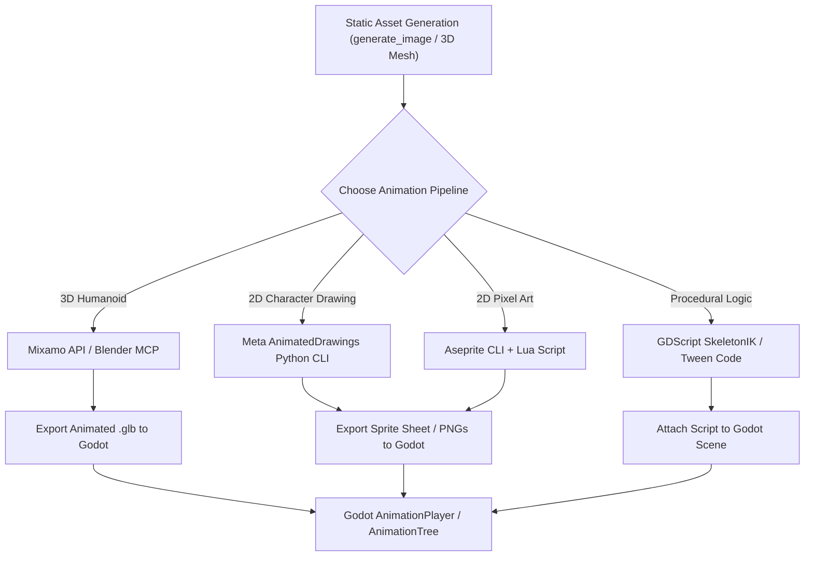

# AI Character Animation Tools & MCP Servers for Agents

**Date:** July 22, 2026  
**Target:** Automated 2D and 3D Character Rigging & Animation Pipeline

---

## 1. Executive Summary

Generating a single static image (via `generate_image`) is only step 1. To turn a static character image into an **animated game character** (walk, run, idle, jump, attack), an AI agent (Antigravity & Pi Agent) can control external animation engines via **MCP Servers**, **CLI Tools**, or **Scripting APIs**.

---

## 2. Dedicated MCP Servers & Tools for Character Animation

### A. Blender MCP Server (`ahujasid/blender-mcp` & `3D-Agent`)
* **Type:** Model Context Protocol (MCP) Server for Blender.
* **How it works:** A local WebSocket bridge connects the AI agent directly to Blender's Python runtime (`bpy`).
* **What the Agent Can Do:**
  * **Auto-Rigging:** Adds armatures (`bpy.ops.object.armature_add()`) and assigns vertex weight groups to 3D meshes.
  * **Keyframe Animation:** Programmatically sets keyframes (`keyframe_insert`) for Walk, Run, Jump, and Attack animations.
  * **NLA (Non-Linear Animation) Tracks:** Creates reusable action tracks for character controllers.
  * **Export to Godot:** Exports ready-to-use `.glb`/`.gltf` animated character models into `res://assets/models/`.

---

### B. Meta's `AnimatedDrawings` Python CLI (`facebookresearch/AnimatedDrawings`)
* **Type:** Open-Source 2D AI Character Rigging & Animation Engine.
* **How it works:** Computer vision models segment 2D drawings, detect body joints, generate a 2D mesh, and apply motion sequences.
* **Agent Automation Workflow:**
  1. Agent generates a static 2D character drawing using `generate_image`.
  2. Agent runs: `python image_to_animation.py character.png` via `run_command`.
  3. `AnimatedDrawings` auto-rigs the drawing, applies motion files (walking, jumping, dancing), and outputs transparent animated sprite sequences into Godot.

---

### C. Mixamo Auto-Rigging API & Automation Scripts
* **Type:** Automated 3D Humanoid Rigging & Motion Library.
* **How it works:** Scripted API interface to Adobe Mixamo.
* **Agent Automation Workflow:**
  1. Agent generates or imports a static 3D T-pose character (`.glb` or `.obj`).
  2. Agent uploads the mesh to Mixamo via Python API.
  3. Agent selects animation packs (Idle, Walk, Sprint, Sword Slash).
  4. Agent downloads the animated `.glb` directly into Godot's `res://assets/models/`.

---

### D. Aseprite CLI & Lua Automation (2D Pixel Art)
* **Type:** 2D Sprite Sheet & Pixel Art Animator CLI.
* **How it works:** Aseprite supports batch execution: `aseprite --batch --script script.lua`.
* **Agent Automation Workflow:**
  1. Agent writes a Lua script for Aseprite to slice frames, apply palette swaps, and generate walking/idle keyframes.
  2. Agent exports a combined `.png` sprite sheet and matching JSON atlas metadata for Godot 2D `AnimatedSprite2D`.

---

### E. Procedural Code Animation in Godot 4 (GDScript `AnimationPlayer` / `Tween`)
* **Type:** Engine-Native Code-Driven Animation.
* **How it works:** Instead of external video assets, the agent writes GDScript using Godot's `Tween` or `AnimationPlayer` node.
* **Examples:**
  * Procedural squash-and-stretch on landing.
  * Procedural limb movement using inverse kinematics (`SkeletonIK2D` / `SkeletonIK3D`).
  * Floating / bobbing items and UI animations.

---

## 3. Comparison of Character Animation Approaches

| Tool / Method | 2D or 3D | Agent Integration Method | Best Used For |
| :--- | :--- | :--- | :--- |
| **`blender-mcp`** | 3D | Live MCP Server (`bpy`) | Custom 3D modeling, rigging, keyframing, and custom NLA animations. |
| **`AnimatedDrawings`** | 2D | Python CLI Script | Converting any 2D image into rigged 2D walking/running sprite animations. |
| **`Mixamo Automation`** | 3D | Python REST API | Fast 3D humanoid character rigging + library of 1,000+ AAA mocap animations. |
| **Aseprite CLI** | 2D | Terminal Batch CLI | 2D pixel art sprite sheet creation and frame-by-frame animation export. |
| **Godot `Tween` / `IK`** | 2D & 3D | Native GDScript Code | Procedural physics animations, squash-and-stretch, limb rotations. |

---

## 4. End-to-End Character Animation Architecture

