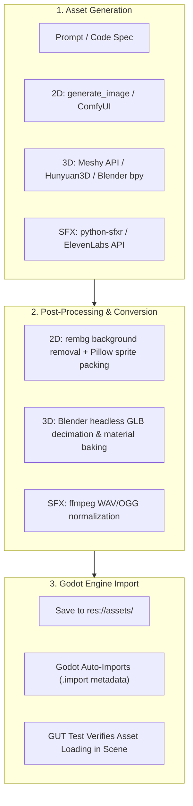

# Deep Research: AI-Automated Game Asset Generation for Agents (Godot 4)

**Date:** July 22, 2026  
**Target:** Automated 2D, 3D, Audio, and Animation Generation for Antigravity & Pi Agent

---

## 1. Executive Summary & Capabilities Overview

Can an AI agent automatically generate game assets (characters, 3D models, textures, animations, and sound effects) for a Godot 4 game? **Yes.**

The asset pipeline combines:
1. **Direct Native Agent Tools** (e.g., `generate_image` for UI, textures, and concept art).
2. **Cloud APIs & Open-Source AI Models** (for 3D mesh generation, AI SFX, and sprite sheets).
3. **Blender CLI Python Scripting (`bpy`)** (for procedural 3D modeling, decimation, and `.glb` exporting).
4. **Code-First Procedural Generators** (for 8-bit sound effects, tilemaps, and UI shaders).

---

## 2. Asset Generation Breakdown by Category

### A. 2D Sprites, Textures & Concept Art

| Method / Tool | Type | Description & Agent Integration |
| :--- | :--- | :--- |
| **`generate_image` (Built-in Tool)** | Native Tool | Native image generator inside Antigravity. Creates UI buttons, icons, tile textures, concept art, and 2D sprite backgrounds directly into `assets/sprites/`. |
| **Stable Diffusion / ComfyUI API** | API / Open-Source | Self-hosted or cloud REST API (e.g. Replicate). Generates isometric sprites, pixel art characters, and tilemaps using ControlNet and character LoRAs. |
| **PixelLab / SpriteFusion API** | Dedicated Service | Web APIs purpose-built for generating 2D pixel art character animations with transparent backgrounds. |
| **Python Post-Processing (`rembg` + `Pillow`)** | Scripting | Agents can run headless Python scripts to automatically remove background colors, pack sprite sheets, and write Godot `.import` files. |

---

### B. 3D Models & PBR Textures

| Tool / Model | Open Source / API | Description & Agent Integration |
| :--- | :--- | :--- |
| **Tencent Hunyuan3D (2.0 / 2.5)** | Open Source | Leading open-source text-to-3D / image-to-3D model. Generates `.obj`/`.glb` models with PBR textures. Can be self-hosted locally on consumer GPUs. |
| **TripoSR** | Open Source | Developed by Stability AI + Tripo. Extremely fast (under 1 second) image-to-3D mesh reconstruction model. |
| **Meshy API** | Commercial REST API | Industry-standard 3D asset generation API. Provides text-to-3D, image-to-3D, auto-texturing, and re-meshing. Returns ready-to-use `.glb` files. |
| **Blender Python Scripting (`bpy`)** | Procedural Code | Blender runs headlessly via CLI: `blender --background --python script.py`. Agents write Python code to build low-poly meshes, apply materials, and export `.glb` files directly into Godot. |

---

### C. 3D Character Rigging & Animation

| Tool | Type | How the Agent Automates It |
| :--- | :--- | :--- |
| **Mixamo Auto-Rigger API** | Cloud Service | Uploads a static humanoid `.glb` model, automatically embeds a skeletal rig, applies animations (Idle, Walk, Run, Jump), and returns an animated `.glb`. |
| **Blender Rigify (`bpy`)** | CLI Scripting | Uses Blender's built-in Rigify addon via Python script to automatically add human/quadruped armatures and perform automatic bone weight painting. |
| **Cascadeur / DeepMotion API** | AI MoCap | Converts 2D video sequences or AI prompts into clean 3D humanoid animation tracks. |

---

### D. Audio, Sound Effects (SFX) & Music

| Tool | Type | Description |
| :--- | :--- | :--- |
| **`python-sfxr` / `jsfxr`** | Code-First Procedural | Open-source retro 8-bit sound generator. Agents write lightweight Python scripts to procedurally synthesize `.wav` sound effects (jump, laser, explosion, coin). |
| **ElevenLabs Sound Effects API** | Cloud REST API | Text-to-SFX generation (e.g. "heavy wooden door opening", "futuristic sci-fi engine rumble"). |
| **Stable Audio / Suno API** | Cloud REST API | Procedural background music generation for game loops and ambient soundtracks. |

---

## 3. Automated Asset Pipeline Architecture for Godot 4

---

## 4. Example: How the Agent Builds a 3D Character Automatically

1. **2D Concept Generation:** Agent calls `generate_image` to create a 2D front-view character concept art.
2. **Image-to-3D Mesh:** Agent sends the concept image to **TripoSR** / **Meshy API** to get a 3D `.glb` character mesh.
3. **Blender Headless Optimization:** Agent runs `blender --background --python process_mesh.py` to fix vertex normals, reduce polycount, and set up PBR materials.
4. **Rigging & Animation:** Agent calls Mixamo / Rigify to attach humanoid animations (Idle, Walk, Jump).
5. **Godot Auto-Import:** Model is saved into `pi-auto-pilot/assets/models/character.glb`. Godot imports it as a `PackedScene`.
6. **Automated Verification:** Agent runs GUT test headlessly (`godot --headless`) to verify the character scene loads with zero errors.

---

## 5. Summary of Recommended Tools to Setup

1. **For 2D Art & UI:** Use built-in `generate_image` tool + `python-sfxr` / `rembg`.
2. **For 3D Models:** Use **Meshy API** (commercial) or **Hunyuan3D / TripoSR** (open-source local GPU) + **Blender CLI**.
3. **For Sound:** Use `python-sfxr` (retro SFX) + ElevenLabs SFX API.
