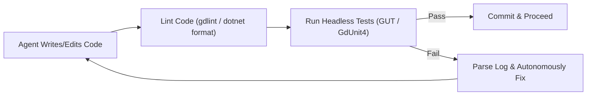

# Game Engine & AI Agent Development Research Notes

**Date:** July 22, 2026  
**Tools & Agents:** Antigravity & Pi Agent (`pi-auto-pilot`)  
**Target:** Building a Game from Scratch using AI Agent Automation

---

## 1. Overview & Engine Comparison

We conducted deep research to determine which game engine or library provides the best ecosystem and support for autonomous/pair-programming AI agents.

### Engine Evaluation Matrix

| Game Engine / Stack | Agent Support Rating | Primary Language | File Format Style | Headless CLI Support | MCP Ecosystem | Summary Verdict |
| :--- | :--- | :--- | :--- | :--- | :--- | :--- |
| **Godot 4.x** | ⭐⭐⭐⭐⭐ (9.8/10) | GDScript / C# | 100% Text-Based (`.tscn`, `.gd`, `.tres`) | Excellent (`godot --headless`) | Native open-source plugins (`godot-ai`) | **Selected Choice**. Best balance of 2D/3D power, text-based scenes, and active agent tools. |
| **Web Stack (Phaser 3 / Three.js)** | ⭐⭐⭐⭐⭐ (9.5/10) | TypeScript / JS | 100% Code-First | Excellent (Vite / Node / Headless Browser) | High via Chrome DevTools MCP | Best for instant browser feedback, DOM/Canvas inspection, and web games. |
| **Raylib** | ⭐⭐⭐⭐☆ (9.0/10) | C / C# / Python | 100% Code-First | Instant terminal execution | N/A | Excellent for pure code minimalists and custom simulations without engine bloat. |
| **Unity** | ⭐⭐⭐⭐☆ (8.0/10) | C# | Mixed (YAML/Binary Scenes & Prefabs) | Moderate (Heavy batchmode launch) | Custom editor scripts | Strong C# LLM knowledge and ML-Agents, but scene manipulation outside editor UI is heavy. |
| **Unreal Engine 5** | ⭐⭐☆☆☆ (5.5/10) | C++ / Blueprints | Binary (`.uasset` Blueprints) | Slow C++ build loops | Limited | **Not recommended** for agent-from-scratch due to binary Blueprints and long compilation times. |

---

## 2. Why Godot 4.x Was Selected

1. **Human-Readable Text Formats (`.tscn` & `.gd`):**
   Unlike engines with binary scene graphs, Godot stores scenes, node hierarchies, materials, and scripts in clean plain-text INI/GDScript formats. An AI agent can read, write, refactor, and generate scenes directly without opening a visual GUI editor.

2. **Lightning-Fast Headless Execution:**
   Godot can execute headlessly in seconds (`godot --headless`), allowing the agent to run automated test suites, verify script logic, and capture error logs in batch mode.

3. **Active Model Context Protocol (MCP) Ecosystem:**
   Godot has dedicated open-source MCP servers bridging the engine live editor to AI agents.

---

## 3. Recommended Open-Source Ecosystem for Godot 4

### A. AI Agent Live Bridges & MCP Plugins
* **[`hi-godot/godot-ai`](https://github.com/hi-godot/godot-ai):** Open-source plugin & MCP server offering 120+ operations (inspecting nodes, editing `.tscn` scenes, setting properties, wiring signals).
* **[`Coding-Solo/godot-mcp`](https://github.com/Coding-Solo/godot-mcp):** CLI-focused bridge to trigger builds and stream debug output to the agent.
* **[`Erodenn/godot-mcp-runtime`](https://github.com/Erodenn/godot-mcp-runtime):** Injectable in-game bridge allowing agents to simulate inputs, capture screenshots, and verify gameplay at runtime.

### B. Automated Testing & Verification Frameworks
* **[GUT (Godot Unit Test)](https://github.com/bitwes/Gut)** *(For GDScript)*:
  * Standard for unit and integration testing in GDScript.
  * Headless execution command with JSON report generation:
    ```bash
    godot --headless --path . -s addons/gut/gut_cmdln.gd -gdir=res://tests -gexit --json-report=report.json
    ```
* **[GdUnit4](https://github.com/MSystem/gdUnit4)** *(For C# / GDScript)*:
  * JUnit-style test framework supporting mocking, scene runners, and C# (`GdUnit4Net`).

### C. Static Analysis & Linters
* **`gdtoolkit` (`gdlint` & `gdformat`):**
  * Static analyzer for GDScript. Install via `pip install gdtoolkit`.
  * Linting command: `gdlint res://scripts/**/*.gd`
  * Formatting command: `gdformat res://scripts/**/*.gd`
* **`dotnet format`:** Standard CLI formatting and type-checking if using C#.

### D. Core Gameplay Helper Plugins
1. **[Godot State Charts](https://github.com/derkork/godot-state-charts):** Hierarchical State Machines (HSMs) to manage player and enemy states cleanly.
2. **[Phantom Camera](https://phantom-camera.dev):** Cinemachine-inspired 2D/3D camera management (smooth tracking, deadzones, camera transitions).
3. **[Dialogue Manager](https://github.com/nathanhoad/godot_dialogue_manager):** Text-based branching dialogue system.
4. **[Godot Jolt](https://github.com/godot-jolt/godot-jolt):** High-performance 3D physics engine replacement for Godot 4.

---

## 4. Recommended Project Architecture & Workflow

### Directory Layout
```
pi-auto-pilot/
├── RESEARCH_GAME_ENGINE_AI_AGENTS.md   # Research note
├── project.godot                       # Godot project file
├── addons/                             # Plugins (GUT, StateCharts, etc.)
├── assets/                             # Sprites, audio, 3D models, fonts
├── scenes/                             # Text-based scenes (.tscn)
│   ├── player/
│   ├── components/
│   └── levels/
├── scripts/                            # Shared scripts (.gd or .cs)
└── tests/                              # GUT automated test files
```

### Agent Test-Driven Development (TDD) Loop



---

## 5. Next Steps

1. Install/verify Godot 4 CLI on local host (`godot --version` or `brew install --cask godot`).
2. Scaffold Godot 4 project structure in `pi-auto-pilot`.
3. Install GUT test runner in `addons/gut/` and configure first automated test script.
